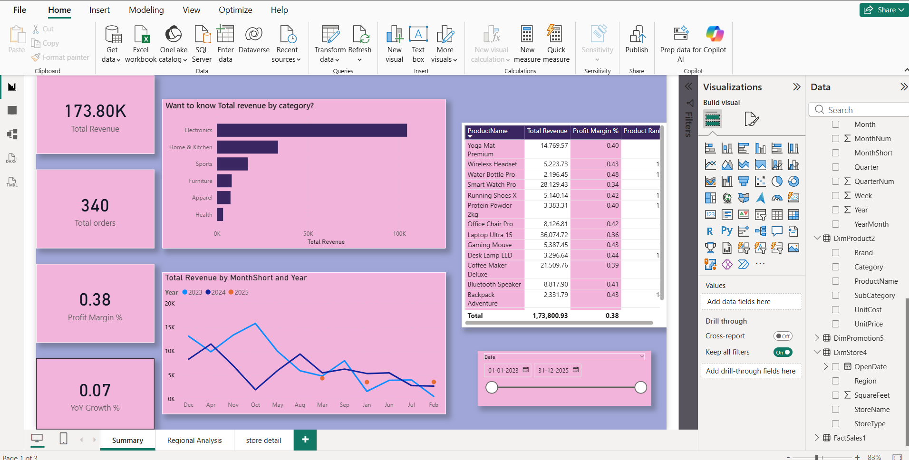

# Sales Analytics Dashboard (Power BI)

##  Overview

This project is an interactive **Power BI dashboard** designed to analyze sales performance across different regions, products, and time periods. It provides key business insights using dynamic visualizations and AI-powered features.

---

## Key Features

* KPI Cards: Total Revenue, Total Orders, Profit Margin %, YoY Growth %
* Time-based analysis using Date hierarchy
* Regional performance analysis
* Category-wise revenue insights
* Drill-down and Drill-through functionality
* AI-powered Q&A for natural language queries

---

##  Dashboard Preview

---

##  Tools & Technologies

* Power BI
* DAX (Data Analysis Expressions)
* Data Modeling (Star Schema)

---

##  Dataset

* Sales data including transactions, products, customers, and regions
* Structured using Fact and Dimension tables

---

##  Key Insights

* Identified top-performing regions and categories
* Analyzed revenue trends over time
* Evaluated profit margins across products

---

##  How to Use

1. Download the `.pbix` file
2. Open in Power BI Desktop
3. Interact with slicers and visuals
4. Use Q&A feature to ask questions

---

